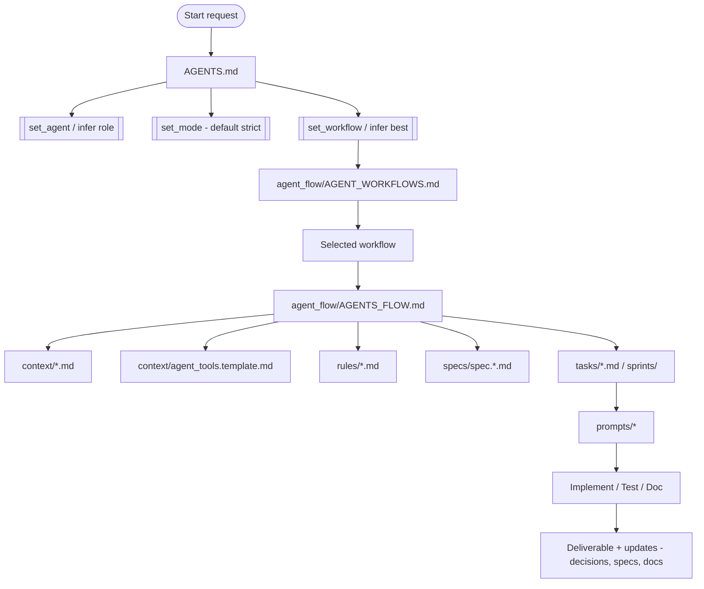

# Agent workflow overview
High-level view of how the agent should operate using this kit.

```mermaid
flowchart TD
    start([Start request]) --> entry[AGENTS.md]
    entry --> setagent[[set_agent / infer role]]
    entry --> setmode[[set_mode - default strict]]
    entry --> setflow[[set_workflow / infer best]]
    setflow --> router[agent_flow/AGENT_WORKFLOWS.md]
    router --> wf[Selected workflow]
    wf --> ops[agent_flow/AGENTS_FLOW.md]
    ops --> context[context/*.md]
    ops --> tools[context/agent_tools.template.md]
    ops --> rules[rules/*.md]
    ops --> specs[specs/spec.*.md]
    ops --> tasks[tasks/*.md / sprints/]
    tasks --> prompts[prompts/*]
    prompts --> dev[Implement / Test / Doc]
    dev --> deliver[Deliverable + updates - decisions, specs, docs]
```

Use this as the quick reminder for users and agents of the flow to follow.
