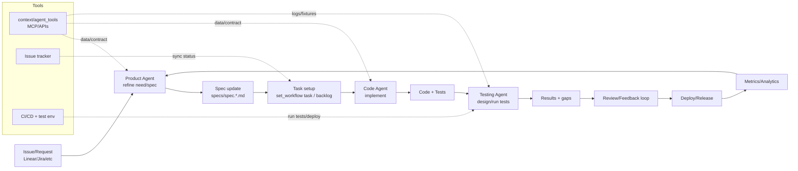

# Developer workflow with tools and agents
Pipeline showing how a dev session flows with roles, workflows, and external tools.

Use this to align devs and agents on the end-to-end pipeline and tool touchpoints.
