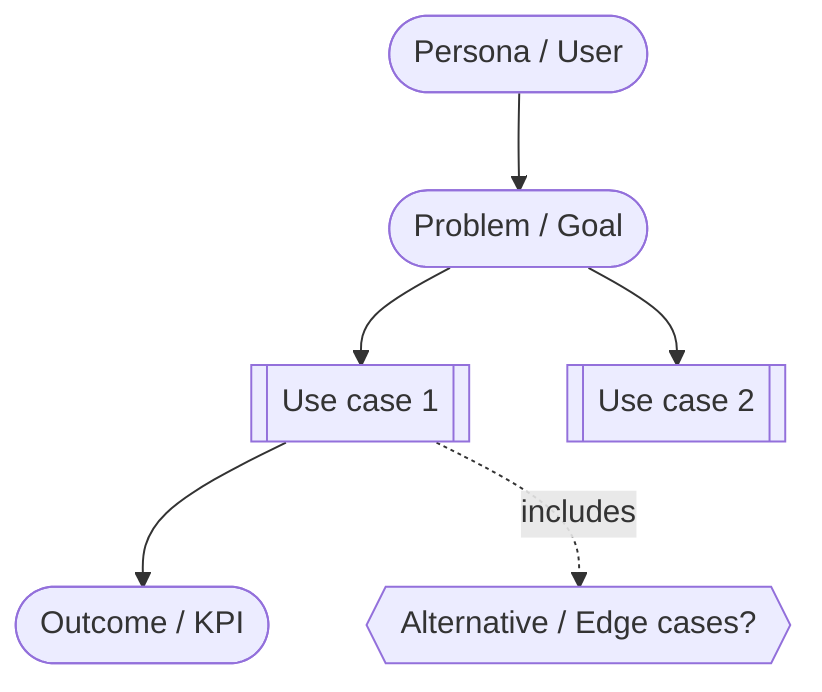

# Use case diagram template
Mermaid template to quickly sketch business use cases linked to tasks/features.

How to use:
- Replace nodes with concrete personas, needs, use cases, edge cases, and KPIs.
- Link this diagram from the relevant task/spec to give the agent a visual summary.
